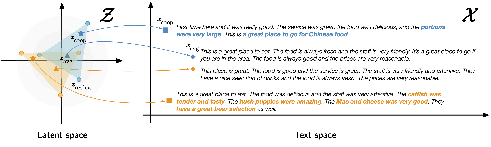

# Convex Aggregation for Opinion Summarization

[](https://aclanthology.org/2021.findings-emnlp.328)
[](https://arxiv.org/abs/2104.01371/)

Code for [Convex Aggregation for Opinion Summarization](https://arxiv.org/abs/2104.01371).

The codebase provides an easy-to-use framework that enables the user to train and use text VAE models with different configurations.

You can also easily configure the architecture of the text VAE model without changing the code at all. You need to use a different Jsonnet file (perhaps with some modification) to train and use a model.



## Citations
```bibtex
@inproceedings{iso21emnlpfindings,
    title = {{C}onvex {A}ggregation for {O}pinion {S}ummarization},
    author = {Hayate Iso and
              Xiaolan Wang and
              Yoshihiko Suhara and
              Stefanos Angelidis and
              Wang{-}Chiew Tan},
    booktitle = {Findings of the Conference on Empirical Methods in Natural Language Processing (EMNLP)},
    month = {November},
    year = {2021}
}
```

## Installation
```bash
conda create -n coop python=3.7
conda activate coop
conda install -c conda-forge jsonnet sentencepiece # If needed
pip install git+https://github.com/megagonlabs/coop.git
```
or
```
git clone https://github.com/megagonlabs/coop.git
cd coop
pip install -e .  # or python setup.py develop
```

## Quick tour
Our unsupervised opinion summarization model can generate a summary by decoding the aggregated latent vectors of inputs.
The proposed framework, ```coop``` will find the best summary based on the input-output overlap.
Here you can firstly encode the input reviews, ```reviews```, into the latent vectors, ```z_raw```:
```python
from typing import List
import torch
from coop import VAE, util

model_name: str = "megagonlabs/bimeanvae-yelp"  # or "megagonlabs/bimeanvae-amzn", "megagonlabs/optimus-yelp", "megagonlabs/optimus-amzn"
vae = VAE(model_name)

reviews: List[str] = [
    "I love this ramen shop!! Highly recommended!!",
    "Here is one of my favorite ramen places! You must try!"
]
z_raw: torch.Tensor = vae.encode(reviews) # [num_reviews * latent_size]
```
Given the latent vectors for input reviews, the model generates summaries from all combinations of latent vectors:
```python
# All combinations of input reviews
idxes: List[List[int]] = util.powerset(len(reviews))
# Taking averages for all combinations of latent vectors
zs: torch.Tensor = torch.stack([z_raw[idx].mean(dim=0) for idx in idxes]) # [2^num_reviews - 1 * latent_size]

outputs: List[str] = vae.generate(zs)
outputs
```
Then, the output looks like this:
```shell
['I love this restaurant!! Highly recommended!!',
 'Here is one of my favorite ramen places! You must try this place!',
 'I love this place! Food is amazing!!']
```
Finally, our framework, Coop, selects the summary based on the input-output overlap:
```python
# Input-output overlap is measured by ROUGE-1 F1 score.
best: str = max(outputs, key=lambda x: util.input_output_overlap(inputs=reviews, output=x))
best
```

Then, the selected summary based on the input-output overlap looks like this:
```shell
'Here is one of my favorite ramen places! You must try this place!'
```

## Evaluate on Dev/Test set
You can easily get the generated examples and evaluate their performance with only 30 lines of code!
Before doing so, you need to download the dev/test set by running the following command.
```bash
# Download dev and test set for evaluation
python scripts/get_summ.py yelp data/yelp
python scripts/get_summ.py amzn data/amzn
```

Then, you can get the generated examples as follows!
```python
import json
from typing import List
import pandas as pd
import torch
import rouge
from coop import VAE, util

task = "yelp"  # or "amzn"
split = "dev"  # or "test"
data: List[dict] = json.load(open(f"./data/{task}/{split}.json"))
model_name: str = f"megagonlabs/bimeanvae-{task}"  # or f"megagonlabs/optimus-{task}"
vae = VAE(model_name)

hypothesis = []
for ins in data:
    reviews: List[str] = ins["reviews"]
    z_raw: torch.Tensor = vae.encode(reviews)
    idxes: List[List[int]] = util.powerset(len(reviews))
    zs: torch.Tensor = torch.stack([z_raw[idx].mean(dim=0) for idx in idxes]) # [2^num_reviews - 1 * latent_size]

    outputs: List[str] = vae.generate(zs, bad_words=util.BAD_WORDS)  # First-person pronoun blocking
    best: str = max(outputs, key=lambda x: util.input_output_overlap(inputs=reviews, output=x))
    hypothesis.append(best)

reference: List[List[str]] = [ins["summary"] for ins in data]

evaluator = rouge.Rouge(metrics=["rouge-n", "rouge-l"], max_n=2, limit_length=False, apply_avg=True,
                        stemming=True, ensure_compatibility=True)

scores = pd.DataFrame(evaluator.get_scores(hypothesis, reference))
scores
```

# Available models
All models are hosted on huggingface :hugs: model hub (https://huggingface.co/megagonlabs/).


| Model name                                                      | Training Data  | Encoder               | Decoder | 
| :-------------------------------------------------------------- | :-------------:|:---------------------:|:-------:|
| [megagonlabs/bimeanvae-yelp](https://huggingface.co/megagonlabs/bimeanvae-yelp) | Yelp           | BiLSTM + Mean Pooling | LSTM    |
| [megagonlabs/optimus-yelp](https://huggingface.co/megagonlabs/optimus-yelp)     | Yelp           | bert-base-cased       | gpt2    |
| [megagonlabs/bimeanvae-amzn](https://huggingface.co/megagonlabs/bimeanvae-amzn) | Amazon         | BiLSTM + Mean Pooling | LSTM    |
| [megagonlabs/optimus-amzn](https://huggingface.co/megagonlabs/optimus-amzn)     | Amazon         | bert-base-cased       | gpt2    |

```VAE``` automatically downloads model checkpoints from the model hub.

## Summarization Performance
### Yelp dataset [(Chu and Liu, 2019)](https://github.com/sosuperic/MeanSum)

| Model name                                                      | Aggregation | ROUGE-1 F1 | ROUGE-2 F1 | ROUGE-L F1 | 
| :-------------------------------------------------------------- |:-----------:|:----------:|:----------:|:----------:|
| [megagonlabs/bimeanvae-yelp](https://huggingface.co/megagonlabs/bimeanvae-yelp) | SimpleAvg   | 32.87      | 6.93       | 19.89      |
| [megagonlabs/bimeanvae-yelp](https://huggingface.co/megagonlabs/bimeanvae-yelp) | Coop        | **35.37**  | **7.35**   | **19.94**  |
| [megagonlabs/optimus-yelp](https://huggingface.co/megagonlabs/optimus-yelp)     | SimpleAvg   | 31.23      | 6.48       | 18.27      |
| [megagonlabs/optimus-yelp](https://huggingface.co/megagonlabs/optimus-yelp)     | Coop        | 33.68      | 7.00       | 18.95      |


### Amazon dataset [(Bražinskas et al., 2020)](https://github.com/abrazinskas/Copycat-abstractive-opinion-summarizer)
| Model name                                                      | Aggregation | ROUGE-1 F1 | ROUGE-2 F1 | ROUGE-L F1 | 
| :-------------------------------------------------------------- |:-----------:|:----------:|:----------:|:----------:|
| [megagonlabs/bimeanvae-amzn](https://huggingface.co/megagonlabs/bimeanvae-amzn) | SimpleAvg   | 33.60     | 6.64     | 20.87     |
| [megagonlabs/bimeanvae-amzn](https://huggingface.co/megagonlabs/bimeanvae-amzn) | Coop        | **36.57** | **7.23** | **21.24** |
| [megagonlabs/optimus-amzn](https://huggingface.co/megagonlabs/optimus-amzn)     | SimpleAvg   | 33.54     | 6.18     | 19.34     |
| [megagonlabs/optimus-amzn](https://huggingface.co/megagonlabs/optimus-amzn)     | Coop        | 35.32     | 6.22     | 19.84     |


# Reproduction

## Setup
```shell
$ unzip coop.zip && cd coop
$ conda create -n coop python=3.7
$ conda activate coop
$ conda install -c conda-forge jsonnet sentencepiece  # If needed
$ pip install -r requirements.txt
```

## Preparation

### Yelp dataset

Download the Yelp dataset from [this link](https://www.yelp.com/dataset).  
You only need the JSON file (`yelp_dataset.tar`).

Move the file to `data/yelp` and uncompress it. You only need `yelp_academic_dataset_review.json`

```bash
$ tar -xvf yelp_dataset.tar
$ YELP_RAW=$(pwd)/yelp_academic_dataset_review.json
```

Run the following preprocessing scripts. This may take several hours, depending on your machine spec.

```bash
$ mkdir -p ./data/yelp
$ python scripts/preprocess.py yelp $YELP_RAW > ./data/yelp/train.jsonl
```

Additionally, you need to download the reference summaries from [this link](https://s3.us-east-2.amazonaws.com/unsup-sum/summaries_0-200_cleaned.csv) provided by [MeanSum](https://github.com/sosuperic/MeanSum)

Run the following command to download and preprocess it.
This will create `dev.json` and `test.json`, which follow the dev/test splits
defined in [the original MeanSum paper](https://arxiv.org/abs/1810.05739).

```
$ python scripts/get_summ.py yelp data/yelp
$ ls data/yelp
train.jsonl
dev.json
test.json
```


### Amazon dataset

Download the Amazon dataset from [this link](http://jmcauley.ucsd.edu/data/amazon/links.html).
You only need the following files for 4 categories:
- [Clothing_Shoes_and_Jewelry.json.gz](http://snap.stanford.edu/data/amazon/productGraph/categoryFiles/reviews_Clothing_Shoes_and_Jewelry.json.gz)
- [Electronics.json.gz](http://snap.stanford.edu/data/amazon/productGraph/categoryFiles/reviews_Electronics.json.gz)
- [Health_and_Personal_Care.json.gz](http://snap.stanford.edu/data/amazon/productGraph/categoryFiles/reviews_Health_and_Personal_Care.json.gz)
- [Home_and_Kitchen.json.gz](http://snap.stanford.edu/data/amazon/productGraph/categoryFiles/reviews_Home_and_Kitchen.json.gz)

Run the script to download the datasets.
You **don't need to uncompress** them.

```shell
$ mkdir amzn_raw && cd amzn_raw
$ wget -P data/amazon http://snap.stanford.edu/data/amazon/productGraph/categoryFiles/reviews_Clothing_Shoes_and_Jewelry.json.gz
$ wget -P data/amazon http://snap.stanford.edu/data/amazon/productGraph/categoryFiles/reviews_Electronics.json.gz
$ wget -P data/amazon http://snap.stanford.edu/data/amazon/productGraph/categoryFiles/reviews_Health_and_Personal_Care.json.gz
$ wget -P data/amazon http://snap.stanford.edu/data/amazon/productGraph/categoryFiles/reviews_Home_and_Kitchen.json.gz
$ AMZN_RAW=$(pwd)
$ ls $AMZN_RAW
Clothing_Shoes_and_Jewelry.json.gz
Electronics.json.gz
Health_and_Personal_Care.json.gz
Home_and_Kitchen.json.gz
$ cd -
```

Run the following preprocessing script. This may take several hours, depending on your machine spec.

```bash
$ mkdir -p ./data/amzn
$ python scripts/preprocess.py amzn $AMZN_RAW > ./data/amzn/train.jsonl
```

Download the reference summaries from this link provided by CopyCat.

Run the following command to download and preprocess it. This will create dev.json and test.json, which follow the dev/test splits defined in the original CopyCat paper.

```bash
$ python scripts/get_summ.py amzn data/amzn
$ ls data/amzn
train.jsonl
dev.json
test.json
```


## Training
### Model and Training Configuration
```config``` directory contains the configuration files used for the experiments. You can copy it and edit the configuration file to run experiments in different settings.

```jsonnet
local lib = import '../utils.libsonnet';
local data_type = "yelp";
local latent_dim = 512;
local free_bit = 0.25;
local num_steps = 100000;
local checkout_step = 1000;
local batch_size = 256;
local lr = 1e-3;

{
    "data_dir": "./data/%s" % data_type,
    "spm_path": "./data/sentencepiece/%s.model" % data_type,
    "model": lib.BiMeanVAE(latent_dim, free_bit),
    "trainer": lib.VAETrainer(num_steps, checkout_step, batch_size, lr)
}

```

### Training a model
To train the model, you can run the following script with ``config`` file and the directory to save checkpoints.
```bash
$ python train.py <config filepath> -s <model dir path>
```

For example,

```bash
$ python train.py config/bimeanvae/yelp.jsonnet -s log/bimeanvae/yelp/ex1
```

## Evaluation
To evaluate the model with our proposed framework, ```coop```, you can simply run the following:
```bash
$ python coop.search.py <model dir path>
```

For example,
```bash
$ python coop.search.py log/bimeanvae/yelp/ex1
```
